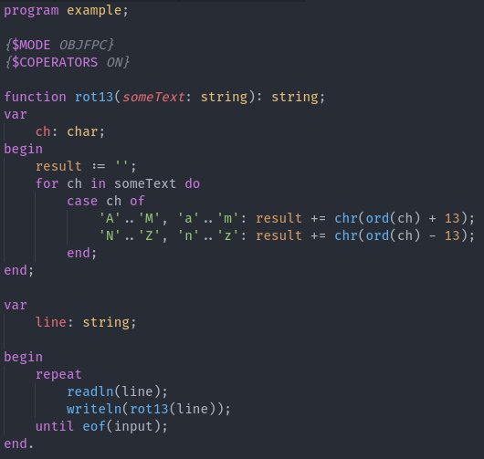

# Pascal magic

High-quality Pascal highlighting made by an actual Pascal programmer

(Yes I still need to figure out how to put this on vscode's marketplace store, but this works for now.)

This extension provides snippets and extensive highlighting support for the Pascal programming language.

## Installation

1) Clone this repo and move it to `$HOME/.vscode/extensions`
2) That should work

## Contributing

I need to put [REON](https://github.com/ALANVF/reon) on NPM first :\(

## Known issues

- Syntax highlighting does NOT like macros
- Preprocessor directives do not play well with semicolons

## Not yet implemented / TODO

- `set` constants
- Complex constant expressions (partially done)
- `objcprotocol` declarations
- `objccategory` declarations
- Custom attributes
- Freestanding generic routines
	- Need to add support for calls without `specialize`, but this is otherwise finished
- This syntax: `function IEqualityComparer<T>.GetHashCode = GetHashCode2;`
- Nested comments
- Highlight type on right-hand side of `is` and `as` expressions
- Highlight generic args in exprs, even if we don't know if it's a type or routine
- Constant expressions in interface IDs should be allowed
- Wtf is a `dispinterface`?
	- Side note: dispid also seems to be an attribute that exists
- `cppclass` (idk what it is, but it's definitely a thing)
- Codepage syntax for `string` types
- Better highlighting for preprocessor directives